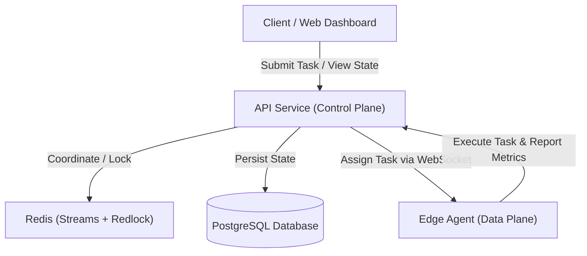

# Architecture Overview

This document provides a progressive, step-by-step introduction to how the Edge-Cloud Orchestrator works under the hood.

---

## Level 1: The 30-Second Version

The Edge-Cloud Orchestrator is a distributed system that schedules and runs containerized workloads. It acts as an intelligent traffic cop, deciding whether to run a task on a centralized cloud cluster or an edge device based on cost, latency, node health, and the carbon footprint of the local power grid.



---

## Level 2: The Main Pieces (5 Minutes)

The codebase is split into three main deployable applications (`apps/`) and a set of shared libraries (`packages/`).

1. **API (`apps/api`)**: The control plane of the system. Exposes REST endpoints for client authentication, task management, and node registration. It hosts the internal `TaskScheduler` background process that runs every 50ms to decide where pending tasks should go.
2. **Agent (`apps/agent`)**: The data plane. A lightweight daemon (written in Rust) running on edge nodes that establishes secure mTLS connections to the control plane, pulls task assignments, executes them inside Docker containers, and streams metrics back.
3. **Web Dashboard (`apps/web`)**: A React user interface that queries the API to display active tasks, node metrics, scheduling latency, and carbon savings in real time.
4. **Shared Packages (`packages/`)**: Modular components isolated for build stability and testing:
   - `shared-kernel`: Core domain models, logging utilities, and validation schemas.
   - `security`: Authentication, mTLS configuration, and ABAC policy validation.
   - `event-bus`: Redis Streams wrapper for asynchronous messaging.
   - `circuit-breaker`: Resilience mechanisms (retries, timeouts, checkpointers).
   - `ml-scheduler`: TensorFlow.js bindings for contextual bandit node scoring and drift detection.

---

## Level 3: How a Task Flows (10 Minutes)

Here is a detailed look at a task's lifecycle as it passes through the system:

```
[Submission] ──> [Validation & ABAC] ──> [Outbox Persistence] 
                                                  │
[Assignment] <── [Redlock Reservation] <── [Scheduler Loop]
      │
[WebSocket Gateway] ──> [Edge Agent] ──> [Docker Sandbox] ──> [Outcome Feedback]
```

### 1. Submission & Intake
- A client calls `POST /v1/tasks` with a Docker image name, runtime arguments, and a **Scheduling Policy** (specifying preferences for Cost, Latency, or Carbon footprint).
- The API validates the inputs using Zod schemas and executes the Attribute-Based Access Control (ABAC) engine to confirm the user has access to the requested target nodes and regions.
- The API saves the task as `PENDING` in PostgreSQL and commits an event to the Transactional Outbox.

### 2. Scheduling & Decision
Every 50ms, the `TaskScheduler` processes pending tasks:
- **Carbon-Aware Shifting**: If the policy favors low carbon intensity and the local grid is currently experiencing high carbon emissions, the scheduler may *defer* the task to a later scheduling window.
- **ML Node Scoring**: For tasks ready to run, the scheduler queries the `SchedulingBandit` (a TensorFlow.js contextual bandit model). The model evaluates candidate node telemetry and historical task success rates to predict which node will execute the task most reliably.
- **Heuristic Filtering**: The engine filters out unhealthy nodes (missing heartbeats) or nodes that lack required CPU/memory resources.
- **Utility Calculation**: It blends the ML prediction with the policy's weights (cost, latency, carbon) to generate a utility score for each node, selecting the highest-scoring candidate.

### 3. Dispatch & Execution
- The API instance claims a Redis `Redlock` lock on the task to ensure no other scheduler replica can claim it.
- The task status is updated to `SCHEDULED`, and the assignment is pushed to the WebSocket Gateway.
- The WebSocket Gateway pushes the execution command to the target Edge Agent.
- The Edge Agent pulls the Docker image, launches the container in a sandbox, and streams performance metrics back to the control plane.

### 4. Completion & Reinforcement Learning
- Once the container finishes, the Agent reports the final status (success/failure) and execution telemetry.
- The API updates the task status in PostgreSQL to `COMPLETED` or `FAILED`.
- The outcome is fed back into the `SchedulingBandit` as reward feedback, allowing the machine learning model to learn and improve future scheduling decisions.

---

## Level 4: The Interesting Engineering Decisions

If you want to understand *why* the system is designed this way, review the Architectural Decision Records (ADRs) under `docs/decisions/`:

- **[ADR-001: TF.js for Inference](docs/decisions/ADR-001-tensorflow-js-not-python.md)**: Why we compile and run the ML scheduler directly inside Node.js using TensorFlow.js, avoiding the overhead and latency of a separate Python microservice.
- **[ADR-002: Redlock for Cluster Coordination](docs/decisions/ADR-002-redlock-distributed-locking.md)**: How multiple API instances coordinate scheduling tasks using Redis distributed locks.
- **[ADR-003: Fastify Framework Selection](docs/decisions/ADR-003-fastify-not-express.md)**: Why we chose Fastify over Express to handle high-throughput scheduling routes.
- **[ADR-004: Rust Edge Agent](docs/decisions/ADR-004-rust-edge-agent.md)**: Why the edge client is implemented in Rust to optimize memory utilization and runtime efficiency.
- **[ADR-005: Transactional Outbox Pattern](docs/decisions/ADR-005-transactional-outbox.md)**: How we avoid split-brain states by writing database records and messaging events in a single transaction.
- **[ADR-006: Attribute-Based Access Control](docs/decisions/ADR-006-abac-not-rbac.md)**: Why we use attributes (region, tenant, resource load) rather than static user roles to secure edge compute nodes.

---

## Level 5: Deep Technical Reference

Ready to dive into the code? Start with these primary entry points:

- **The Core Scheduler Engine**: [task-scheduler.ts](file:///d:/Projects/Cloud1/edge-cloud-orchestrator/apps/api/src/services/task-scheduler.ts)
- **Task Admission Routes**: [tasks.ts](file:///d:/Projects/Cloud1/edge-cloud-orchestrator/apps/api/src/routes/tasks.ts)
- **Node Heartbeats & Registry Routes**: [nodes.ts](file:///d:/Projects/Cloud1/edge-cloud-orchestrator/apps/api/src/routes/nodes.ts)
- **Edge Agent Main Loop**: [agent.rs](file:///d:/Projects/Cloud1/edge-cloud-orchestrator/apps/agent/src/agent.rs)
- **ABAC Engine**: [abac.ts](file:///d:/Projects/Cloud1/edge-cloud-orchestrator/packages/security/src/abac.ts)
- **mTLS Logic**: [mtls.ts](file:///d:/Projects/Cloud1/edge-cloud-orchestrator/packages/security/src/mtls.ts)
