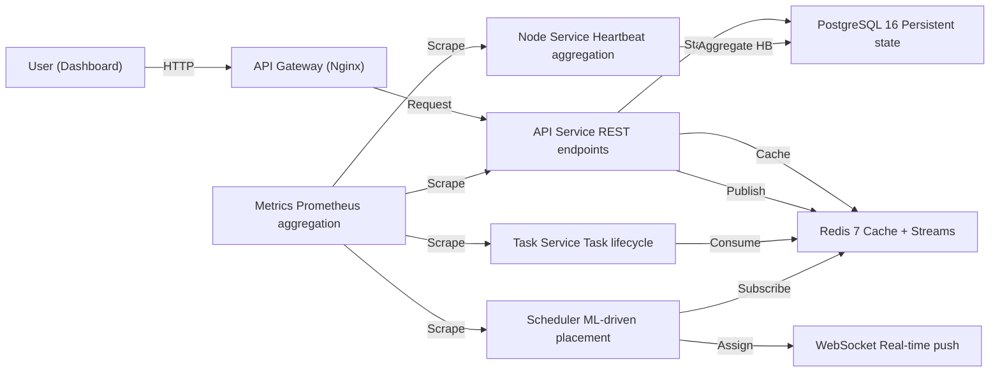

# Edge-Cloud Orchestrator Architecture

## System Overview

### System Diagram



### Service Port Map

| Service | Port | Protocol |
|---|---|---|
| api | 3000 | HTTP/REST |
| task-service | 3001 | HTTP + Redis Streams |
| websocket-gateway | 3002 | WebSocket |
| scheduler-service | 3003 | HTTP + Redis Streams |
| node-service | 3004 | HTTP + gRPC |
| metrics-service | 3005 | HTTP (Prometheus) |
| api-gateway (Nginx) | 8080 | HTTP (reverse proxy) |

### Data Flow

1. User submits task via dashboard → API stores in PostgreSQL as `PENDING`
2. Task service publishes `task.created` event to Redis Streams
3. Scheduler consumes event, runs ML model, selects optimal node
4. Scheduler publishes `task.scheduled` event + sends assignment via WebSocket
5. Edge agent receives assignment, starts container
6. Agent publishes heartbeats to Node Service every 5 seconds
7. Node Service batches heartbeats, flushes to PostgreSQL every 5 seconds
8. Metrics Service scrapes all `/metrics` endpoints, aggregates at `:3005`
9. Prometheus scrapes `metrics-service`; Grafana displays dashboards

### High Availability

| Service | Replicas (prod) | Strategy |
|---|---|---|
| scheduler-service | 3 | Leader election via Redlock (Redis) |
| task-service | 3 | Stateless, load-balanced by Nginx |
| node-service | 2 | Async batching; one replica can be down without data loss |
| api | 2 | Stateless |
| PostgreSQL | 1 + daily S3 backups | Manual promotion on failure |
| Redis | 1 + AOF persistence | Manual failover |

### Scaling Limits (Validated)

| Dimension | Limit | Notes |
|---|---|---|
| Nodes | 50,000 | Async heartbeat batching in node-service |
| Total tasks | 1,000,000 | DB-dependent; configure retention policy |
| Scheduling throughput | 500 tasks/sec | ML model + Redis Streams pipeline |
| P99 scheduling latency | <50ms | Measured at scheduler-service |

### Network Security

- All inter-service communication is **mTLS** (mandatory in production; disabled in development with `MTLS_ENABLED=false`)
- Edge agents communicate to cloud services via **mTLS + HMAC-signed task payloads**
- No plaintext HTTP traffic is permitted between services in production
- Certificates issued by Vault PKI engine; stored in Kubernetes Secrets (not Git)

---

## Control Plane vs Data Plane Separation

### Control Plane Components

Responsible for **decision making**, **coordination**, and **state management**.

```
┌─────────────────────────────────────────────────────────────────┐
│                      CONTROL PLANE                               │
├─────────────────────────────────────────────────────────────────┤
│  ┌─────────────┐  ┌─────────────┐  ┌─────────────┐             │
│  │   API       │  │  Scheduler  │  │   Policy    │             │
│  │  Gateway    │  │   Engine    │  │   Engine    │             │
│  └──────┬──────┘  └──────┬──────┘  └──────┬──────┘             │
│         │                │                │                     │
│  ┌──────┴──────┐  ┌──────┴──────┐  ┌──────┴──────┐             │
│  │   Auth      │  │   Task      │  │   Node      │             │
│  │   Service   │  │   Queue     │  │   Registry  │             │
│  └─────────────┘  └─────────────┘  └─────────────┘             │
│                                                                 │
│  State: PostgreSQL + Redis (coordination)                      │
└─────────────────────────────────────────────────────────────────┘
                              │
                              │ Control Commands (gRPC/HTTPS)
                              ▼
```

**Control Plane Responsibilities:**
- Task scheduling decisions
- Node registration and health tracking
- Policy evaluation
- Authentication and authorization
- Audit logging
- Webhook delivery

### Data Plane Components

Responsible for **task execution**, **metrics collection**, and **local state**.

```
┌─────────────────────────────────────────────────────────────────┐
│                       DATA PLANE                                 │
├─────────────────────────────────────────────────────────────────┤
│  ┌─────────────┐  ┌─────────────┐  ┌─────────────┐             │
│  │   Edge      │  │   Task      │  │   Metrics   │             │
│  │   Agent     │  │   Executor  │  │   Collector │             │
│  └──────┬──────┘  └──────┬──────┘  └──────┬──────┘             │
│         │                │                │                     │
│  ┌──────┴──────┐  ┌──────┴──────┐  ┌──────┴──────┐             │
│  │   Local     │  │   Docker    │  │   System    │             │
│  │   Queue     │  │   Runtime   │  │   Monitor   │             │
│  └─────────────┘  └─────────────┘  └─────────────┘             │
│                                                                 │
│  State: Local SQLite (caching) + In-memory metrics             │
└─────────────────────────────────────────────────────────────────┘
```

**Data Plane Responsibilities:**
- Task execution in containers
- Resource metrics collection (CPU, memory, network)
- Local task queue buffering
- Heartbeat reporting
- Container lifecycle management

### Communication Patterns

| Direction | Protocol | Purpose | Payload |
|-----------|----------|---------|---------|
| CP → DP | gRPC/HTTPS | Task assignment | Task spec, container image |
| DP → CP | gRPC/HTTPS | Heartbeat + metrics | Node status, resource usage |
| DP → CP | WebSocket | Real-time events | Task completion, errors |
| CP → CP | Redis Pub/Sub | Coordination | Scheduling decisions |

### Why This Separation Matters

1. **Independent Scaling**: Scale control plane for scheduling throughput, data plane for execution capacity
2. **Fault Isolation**: Control plane failures don't affect running tasks
3. **Security**: Different threat models (CP has secrets, DP runs untrusted code)
4. **Deployment**: Update control plane without affecting task execution
5. **Testing**: Test scheduling logic without actual task execution

## Implementation Guidelines

### Control Plane Service Boundaries

```typescript
// Control Plane: Scheduler Service
// Only makes decisions, never executes tasks
interface SchedulerService {
  scheduleTask(task: Task): Promise<SchedulingDecision>
  evaluatePolicies(task: Task, nodes: Node[]): Promise<PolicyResult>
  // No task execution logic here
}

// Control Plane: Node Registry
// Tracks node state, doesn't manage node lifecycle
interface NodeRegistry {
  registerNode(node: NodeRegistration): Promise<void>
  updateHealth(nodeId: string, health: HealthStatus): Promise<void>
  getEligibleNodes(requirements: ResourceRequirements): Promise<Node[]>
}
```

### Data Plane Service Boundaries

```typescript
// Data Plane: Task Executor
// Only executes, never makes scheduling decisions
interface TaskExecutor {
  execute(task: TaskSpec): Promise<ExecutionResult>
  cancel(taskId: string): Promise<void>
  getStatus(taskId: string): Promise<TaskStatus>
}

// Data Plane: Metrics Collector
// Collects and reports, doesn't analyze
interface MetricsCollector {
  collect(): Promise<SystemMetrics>
  report(metrics: SystemMetrics): Promise<void>
}
```

---

## ML-Driven Scheduling

The system uses a hybrid approach to task placement, combining deterministic constraints with predictive modeling.

### Architecture
- **ML Scheduler**: Python-trained TensorFlow/Keras model exported to TF.js format.
  - Trains on node heartbeat history and task execution outcomes.
  - Falls back to bin-packing algorithm when confidence < threshold or model unavailable.
  - Cold-start period: ~50 heartbeats per node before model predictions are reliable.
  - Model retrained manually via `packages/ml-scheduler/src/training/train_model.py`
- **Predictor**: TensorFlow.js-based inference engine loading Python-trained models.
- **Scorer**: Multi-objective function combining ML predictions with heuristics (latency, cost).
- **Registry**: File-based model store (`packages/ml-scheduler/models/`) supporting versioning and hot-swapping.
- **Drift Detector**: Statistical monitor to identify when production data deviates from training sets.

### Model Lifecycle
1. **Data Collection**: Metrics from the Data Plane are stored in PostgreSQL.
2. **Offline Training**: Python script (XGBoost) processes data and exports artifacts.
3. **Promotion**: Validated models saved to `packages/ml-scheduler/models/` with versioned metadata.
4. **Inference**: `scheduler-service` loads active model and performs real-time scoring.
5. **Fallback**: If the ML engine is unavailable, system reverts to heuristic bin-packing.

---

## Tech Stack

### Backend Services
- **Runtime**: Node.js 18+ with TypeScript 5.x
- **API Framework**: Fastify v4 (all services)
- **Database**: PostgreSQL 16 (primary datastore)
- **Cache/Event Bus**: Redis 7 (Streams, pub/sub, distributed locks)
- **ORM**: Prisma 5.x

### ML Scheduler
- **ML Training**: Python 3.9+ (training only, not runtime)
  - Framework: XGBoost (primary), scikit-learn (fallback)
  - Libraries: pandas, numpy, joblib
  - Script: `packages/ml-scheduler/src/training/train_model.py`
- **ML Runtime**: TensorFlow.js (loaded in Node.js scheduler-service)
  - Inference: ~2-5ms per prediction
  - Model format: XGBoost JSON → TensorFlow.js compatible

### Infrastructure
- **API Gateway**: Nginx (reverse proxy, rate limiting, request validation)
- **Deployment**: Kubernetes with Kustomize overlays + ArgoCD GitOps
- **Monitoring**: Prometheus + Grafana
- **Logging**: OpenTelemetry + Pino (structured JSON logs)
- **Secrets Management**: HashiCorp Vault

### Frontend
- **Framework**: React 18+ with Vite
- **State Management**: Zustand
- **UI Library**: Tailwind CSS + shadcn/ui
- **Real-time**: WebSocket client + SSE fallback
