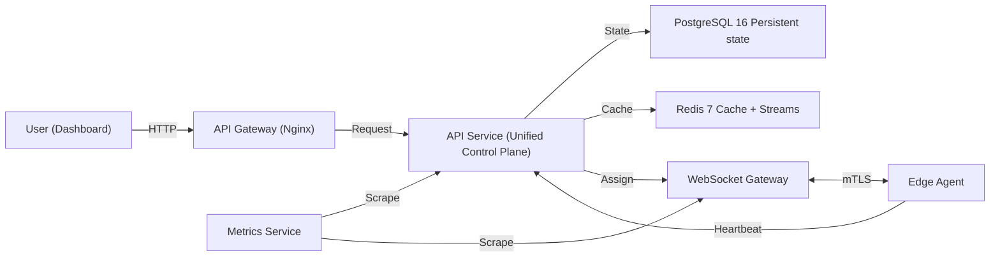
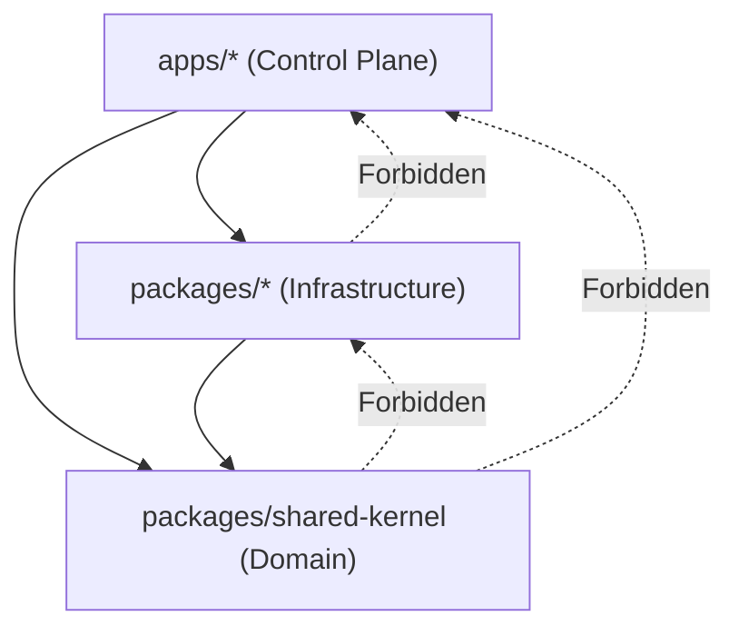

# Edge-Cloud Orchestrator Architecture

## System Overview

### System Diagram



### Service Port Map

| Service | Port | Protocol |
|---|---|---|
| api (Unified) | 3090 | HTTP/REST + Internal Scheduler |
| websocket-gateway | 3004 | WebSocket |
| metrics-service | 3005 | HTTP (Prometheus Aggregator) |
| api-gateway (Nginx) | 80/443 | HTTP/HTTPS (reverse proxy) |

> [!NOTE]
> In the v2.0.0 refactor, the **Task Service**, **Scheduler Service**, and **Node Service** were consolidated into the core **API Service**. This allows the scheduler to run as an internal background process within the API instances, significantly reducing inter-service latency and simplifying the Raft-based coordination logic.

### Data Flow

1. User submits task via dashboard → API stores in PostgreSQL as `PENDING`
2. Internal `TaskScheduler` in API instance picks up task, runs ML model, selects optimal node
3. API updates task status and notifies `websocket-gateway`
4. `websocket-gateway` sends assignment to the targeted Edge Agent
5. Edge agent receives assignment, starts container
6. Agent publishes heartbeats and execution metrics back to API every 5 seconds
7. API batches heartbeats, flushes to PostgreSQL `node_metrics` partition
8. Metrics Service scrapes all `/metrics` endpoints from API and Gateways
9. Prometheus scrapes `metrics-service`; Grafana displays dashboards

### High Availability

| Service | Replicas (prod) | Strategy |
|---|---|---|
| api (Unified) | 3 | Multi-leader with Redlock-based task acquisition |
| websocket-gateway | 2 | Stateless, regional affinity |
| PostgreSQL | 1 Primary + 1 Standby | Synchronous streaming replication; PgBouncer pooler |
| Redis | 1 Primary + 2 Replicas | HA Sentinel with 3 sentinels; auto-failover |

> [!TIP]
> For production environments, it is highly recommended to migrate to managed database services like **AWS RDS Multi-AZ**, **Azure Database for PostgreSQL**, or **Google CloudSQL**. These services provide automated failover, point-in-time recovery, and 99.99% availability SLAs that are difficult to match with self-managed Kubernetes deployments.

### Scaling Limits (Validated)

| Dimension | Limit | Notes |
|---|---|---|
| Nodes | 50,000 | Async heartbeat batching in api |
| Total tasks | 1,000,000 | DB-dependent; configure retention policy |
| Node Metrics | 6,000,000,000 | Native range partitioning (daily) with 7-day retention |
| Scheduling throughput | 500 tasks/sec | ML model + Redis Streams pipeline |
| P99 scheduling latency | <50ms | Measured at api |

> [!IMPORTANT]
> **Database Growth Mitigation**: The `node_metrics` table is partitioned by range on the `timestamp` column. Daily partitions are managed by `pg_partman` with a strict 7-day retention policy. This allows the system to ingest ~864M rows/day while keeping the active dataset size manageable and ensuring constant-time query performance for the last 7 days of history.

---

## Disaster Recovery

The system defines strict targets for data recovery and service availability to ensure business continuity during catastrophic failures.

### Recovery Objectives

| Metric | Target | Description |
|---|---|---|
| **RPO** (Recovery Point Objective) | 1 hour | Maximum acceptable data loss duration. |
| **RTO** (Recovery Time Objective) | 30 minutes | Maximum acceptable downtime to restore services. |

### Backup Strategy

1. **PostgreSQL**: Continuous Write-Ahead Log (WAL) archiving via **pgBackRest**.
   - **Continuous Archiving**: Every transaction is archived to S3 within minutes (~5min RPO).
   - **Full Backups**: Weekly (Sunday 2am).
   - **Differential Backups**: Daily/6-hourly to minimize restore time.
   - **Retention**: 7 daily and 4 weekly backups preserved.
2. **Redis**: AOF (Append Only File) persistence with `fsync everysec`.
   - **Persistence**: Durable state for task coordination and distributed locks.
   - **Offsite Backup**: Daily archival of AOF files to S3 with 7-day retention.
3. **ML Models**: All weights and training artifacts stored in versioned S3 buckets.
   - **Versioning**: Enabled to protect against accidental deletion or corruption.
   - **Cross-Region Replication**: Automatic replication to a secondary region for geographic redundancy.

### Automated Restore Testing

A backup that hasn't been tested for restoration is not a backup. The system implements an automated **Monthly Restore Test** in the staging environment:
- **Procedure**: Automated CronJob restores the latest production backup to a transient PostgreSQL instance.
- **Validation**: Runs data integrity checks, row counts, and timestamp verification.
- **Alerting**: Reports success/failure to the engineering Slack channel.
- **Cleanup**: Ephemeral instances are destroyed immediately after verification.

---

## Redis Sentinel Failover

The system utilizes a Redis Sentinel architecture (1 Primary + 2 Replicas + 3 Sentinels) to eliminate Redis as a single point of failure.

### Failover Characteristics
1. **Failure Detection**: Sentinels monitor the primary and replicas. If the primary is unreachable for 30s (`down-after-milliseconds`), a failover is initiated.
2. **Leader Election**: Sentinels vote to elect a new primary from the available replicas. This typically completes in <10 seconds once a quorum (2/3) is reached.
3. **Client Redirection**: All services use `ioredis` with Sentinel support. Upon failover, clients receive a notification from the Sentinels and automatically reconnect to the new primary.
4. **Service Resilience**:
   - **Liveness Probing**: The API Gateway and core services include a 30s Redis liveness buffer. If Redis is unreachable for more than 30s, the pod enters an unhealthy state and is restarted by Kubernetes.
   - **Readiness Probing**: Services will not accept traffic until a valid connection to either a Sentinel or a Redis Primary is established.
   - **Data Consistency**: AOF (Append Only File) is enabled on all nodes with `fsync everysec` to minimize data loss during failover.

### Network Security

- All inter-service communication is **mTLS** (mandatory in production; disabled in development with `MTLS_ENABLED=false`)
- Edge agents communicate to cloud services via **mTLS + HMAC-signed task payloads**
- No plaintext HTTP traffic is permitted between services in production
- Certificates issued by Vault PKI engine; stored in Kubernetes Secrets (not Git)

---

## Control Plane vs Data Plane Separation

### Control Plane Components

Responsible for **decision making**, **coordination**, and **state management**.

```
┌─────────────────────────────────────────────────────────────────┐
│                      CONTROL PLANE                               │
├─────────────────────────────────────────────────────────────────┤
│  ┌───────────────────────────────────────────────────────────┐  │
│  │                     API SERVICE (Unified)                 │  │
│  │   (Scheduling, Node Registry, Auth, Policy, Lifecycle)    │  │
│  └──────────────────────────────┬────────────────────────────┘  │
│                                 │                               │
│  State: PostgreSQL + Redis (coordination)                      │
└─────────────────────────────────────────────────────────────────┘
                              │
                              │ Control Commands (gRPC/HTTPS)
                              ▼
```

**Control Plane Responsibilities:**
- Task scheduling decisions
- Node registration and health tracking
- Policy evaluation
- Authentication and authorization
- Audit logging
- Webhook delivery

### Data Plane Components

Responsible for **task execution**, **metrics collection**, and **local state**.

```
┌─────────────────────────────────────────────────────────────────┐
│                       DATA PLANE                                 │
├─────────────────────────────────────────────────────────────────┤
│  ┌─────────────┐  ┌─────────────┐  ┌─────────────┐             │
│  │   Edge      │  │   Task      │  │   Metrics   │             │
│  │   Agent     │  │   Executor  │  │   Collector │             │
│  └──────┬──────┘  └──────┬──────┘  └──────┬──────┘             │
│         │                │                │                     │
│  ┌──────┴──────┐  ┌──────┴──────┐  ┌──────┴──────┐             │
│  │   Local     │  │   Docker    │  │   System    │             │
│  │   Queue     │  │   Runtime   │  │   Monitor   │             │
│  └─────────────┘  └─────────────┘  └─────────────┘             │
│                                                                 │
│  State: Local SQLite (caching) + In-memory metrics             │
└─────────────────────────────────────────────────────────────────┘
```

**Data Plane Responsibilities:**
- Task execution in containers
- Resource metrics collection (CPU, memory, network)
- Local task queue buffering
- Heartbeat reporting
- Container lifecycle management

### Communication Patterns

| Direction | Protocol | Purpose | Payload |
|-----------|----------|---------|---------|
| CP → DP | gRPC/HTTPS | Task assignment | Task spec, container image |
| DP → CP | gRPC/HTTPS | Heartbeat + metrics | Node status, resource usage |
| DP → CP | WebSocket | Real-time events | Task completion, errors |
| CP → CP | Redis Pub/Sub | Coordination | Scheduling decisions |

### Why This Separation Matters

1. **Independent Scaling**: Scale control plane for scheduling throughput, data plane for execution capacity
2. **Fault Isolation**: Control plane failures don't affect running tasks
3. **Security**: Different threat models (CP has secrets, DP runs untrusted code)
4. **Deployment**: Update control plane without affecting task execution
5. **Testing**: Test scheduling logic without actual task execution

## Implementation Guidelines

### Control Plane Service Boundaries

```typescript
// Control Plane: Scheduler Service
// Only makes decisions, never executes tasks
interface SchedulerService {
  scheduleTask(task: Task): Promise<SchedulingDecision>
  evaluatePolicies(task: Task, nodes: Node[]): Promise<PolicyResult>
  // No task execution logic here
}

// Control Plane: Node Registry
// Tracks node state, doesn't manage node lifecycle
interface NodeRegistry {
  registerNode(node: NodeRegistration): Promise<void>
  updateHealth(nodeId: string, health: HealthStatus): Promise<void>
  getEligibleNodes(requirements: ResourceRequirements): Promise<Node[]>
}
```

### Data Plane Service Boundaries

```typescript
// Data Plane: Task Executor
// Only executes, never makes scheduling decisions
interface TaskExecutor {
  execute(task: TaskSpec): Promise<ExecutionResult>
  cancel(taskId: string): Promise<void>
  getStatus(taskId: string): Promise<TaskStatus>
}

// Data Plane: Metrics Collector
// Collects and reports, doesn't analyze
interface MetricsCollector {
  collect(): Promise<SystemMetrics>
  report(metrics: SystemMetrics): Promise<void>
}
```

---

## ML-Driven Scheduling

The system uses a hybrid approach to task placement, combining deterministic constraints with predictive modeling.

### Architecture
- **ML Scheduler**: Python-trained TensorFlow/Keras model exported to TF.js format.
  - Trains on node heartbeat history and task execution outcomes.
  - Falls back to bin-packing algorithm when confidence < threshold or model unavailable.
  - Cold-start period: ~50 heartbeats per node before model predictions are reliable.
  - Model retrained manually via `packages/ml-scheduler/src/training/train_model.py`
- **Predictor**: TensorFlow.js-based inference engine loading Python-trained models.
- **Scorer**: Multi-objective function combining ML predictions with heuristics (latency, cost).
- **Registry**: File-based model store (`packages/ml-scheduler/models/`) supporting versioning and hot-swapping.
- **Drift Detector**: Statistical monitor to identify when production data deviates from training sets.

### Model Lifecycle
1. **Data Collection**: Metrics from the Data Plane are stored in PostgreSQL.
2. **Offline Training**: Python script (XGBoost) processes data and exports artifacts.
3. **Promotion**: Validated models saved to `packages/ml-scheduler/models/` with versioned metadata.
4. **Inference**: `api` service loads active model and performs real-time scoring.
5. **Fallback**: If the ML engine is unavailable, system reverts to heuristic bin-packing.

---

## Object Storage for ML Assets

Large binary assets, specifically ML model weights and training artifacts, are offloaded from the primary PostgreSQL database to S3-compatible object storage (e.g., AWS S3, Google Cloud Storage, or MinIO).

### Architecture
- **Metadata Storage**: PostgreSQL stores references (`weightsUrl`) and metadata (`weightsSize`) in the `FLModel` table.
- **Binary Storage**: Binary weights are stored in an S3 bucket with the prefix `models/{modelId}/weights.bin`.
- **Storage Service**: `ModelStorageService` in the `ml-scheduler` package handles the logic for multi-part uploads and stream-based downloads.

### Benefits
1. **Database Scalability**: Prevents PostgreSQL table bloat caused by GB-sized binary blobs.
2. **Backup Performance**: Reduces the size of database backups and speeds up recovery times.
3. **CDN Integration**: Allows serving weights via CDN for faster distribution to edge nodes.
4. **Lifecycle Management**: Older model versions can be automatically moved to cheaper storage tiers (e.g., AWS Glacier) after a defined period (default: 90 days).

### Cost Optimization (Lifecycle Policy)
The following lifecycle rules are applied to the S3 bucket:
- **Active Tier**: Current and recent model weights (Standard storage).
- **Glacier Transition**: Objects older than 90 days are transitioned to Glacier storage for cost-effective long-term archival.
- **Expiration**: (Optional) Development or temporary model weights can be set to expire after a certain period if not promoted to production.

---

## Tech Stack

### Backend Services
- **Runtime**: Node.js 18+ with TypeScript 5.x
- **API Framework**: Fastify v4 (all services)
- **Database**: PostgreSQL 16 (primary datastore)
- **Cache/Event Bus**: Redis 7 (Streams, pub/sub, distributed locks)
- **ORM**: Prisma 5.x

### ML Scheduler
- **ML Training**: Python 3.9+ (training only, not runtime)
  - Framework: XGBoost (primary), scikit-learn (fallback)
  - Libraries: pandas, numpy, joblib
  - Script: `packages/ml-scheduler/src/training/train_model.py`
- **ML Runtime**: TensorFlow.js (loaded in Node.js api service)
  - Inference: ~2-5ms per prediction
  - Model format: XGBoost JSON → TensorFlow.js compatible

### Infrastructure
- **API Gateway**: Nginx (reverse proxy, rate limiting, request validation)
- **Deployment**: Kubernetes with Kustomize overlays + ArgoCD GitOps
- **Monitoring**: Prometheus + Grafana
- **Logging**: OpenTelemetry + Pino (structured JSON logs)
- **Secrets Management**: HashiCorp Vault

### Frontend
- **Framework**: React 18+ with Vite
- **State Management**: Zustand
- **UI Library**: Tailwind CSS + shadcn/ui
- **Real-time**: WebSocket client + SSE fallback

---

## Monorepo Dependency Architecture

To prevent circular dependencies and maintain a clear separation of concerns, the monorepo follows a strict layered dependency hierarchy. These rules are enforced via `.dependency-cruiser.js` in the CI pipeline.

### Dependency Hierarchy



### Strict Rules

| Package | Allowed Dependencies | Rule |
|---------|----------------------|------|
| `shared-kernel` | None | Must have **ZERO** dependencies on other internal packages. |
| `ml-scheduler` | `shared-kernel` | May depend on `shared-kernel` **ONLY**. |
| `circuit-breaker` | `shared-kernel` | May depend on `shared-kernel` **ONLY**. |
| `outbox` | `shared-kernel` | May depend on `shared-kernel` **ONLY**. |
| `saga` | `shared-kernel`, `circuit-breaker` | May depend on `shared-kernel` and `circuit-breaker` only. |
| `apps/*` | Any package | May depend on any package in the `packages/` directory. |

### Architectural Guards

1. **Circular Dependencies**: Strictly forbidden across all packages and apps.
2. **Upward Flow**: Packages must never depend on code within the `apps/` directory.
3. **Sideways Coupling**: Internal packages should generally avoid depending on each other unless explicitly whitelisted above to ensure test isolation and build stability.

---


To handle the massive ingestion volume of node heartbeats (~864 million rows per day at full scale), the system implements **PostgreSQL Native Range Partitioning** on the `node_metrics` table.

### Partitioning Strategy
- **Partition Key**: `timestamp` (TIMESTAMP(3))
- **Interval**: Daily (partitions created automatically by `pg_partman`)
- **Primary Key**: Composite `(id, timestamp)` to satisfy PostgreSQL partitioning requirements.
- **Indices**:
    - `(nodeId, timestamp DESC)`: Propagated to all partitions to optimize dashboard queries and time-series lookups.
    - `(timestamp)`: For range-based cleanup and interval queries.

### Retention Policy
The `TaskScheduler` runs a daily maintenance job (`runRetentionCleanup`) that:
1. Calls `partman.run_maintenance('public.node_metrics')`.
2. `pg_partman` creates partitions for the next 4 days (default `premake`).
3. `pg_partman` drops partitions older than **7 days**, permanently deleting the data to reclaim storage.

### Performance Impact
- **Ingestion**: Writing to partitions is faster than a single large table because the indices for the "current" partition are likely to fit in memory.
- **Cleanup**: Dropping an old partition is a metadata-only operation (`DROP TABLE`), avoiding the heavy transaction log and vacuuming overhead of `DELETE` statements.
- **Queries**: The PostgreSQL query planner uses **partition pruning** to only scan relevant daily tables based on the `timestamp` range in the `WHERE` clause.
